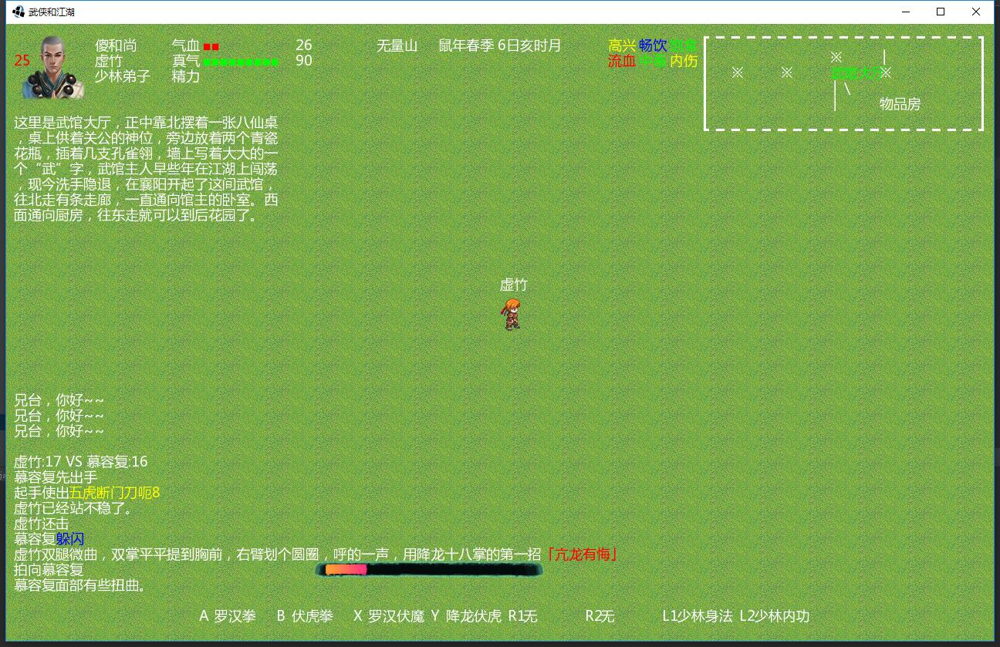
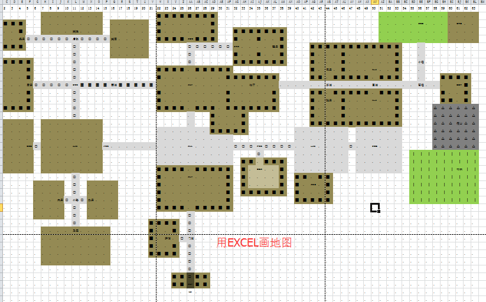
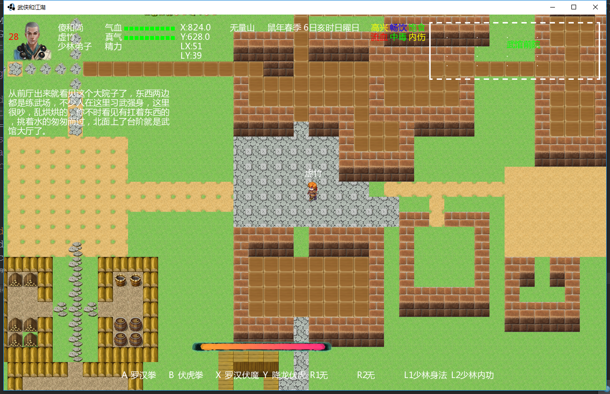

# 武侠与江湖
欢迎大家来到《武侠与江湖》，这是一个用LibGDX游戏框架做的武侠沙盘角色扮演类游戏，暂定名称为《武侠与江湖》，目前还只是开发中，只有简单的功能。

## 游戏主题
穿越到武侠的年代，想办法在新的环境中生存下去。吃喝嫖赌、琴棋书画。成为一代侠之大者，或者富甲天下，或者结交好友纵意江湖~~

## 游戏特点
丰富的人物属性需求、错综复杂的武侠世界、丰富多彩的武功秘籍、封闭式的生产销售经济系统、随机的人物关系、充满变数的江湖。
PS:上面这些都是想法，还没实现。

## 游戏参考
* 游戏风格。大灾变CDDA http://en.cataclysmdda.com/ 里面的生存，开发，所以，画面估计就那样，游戏性比不上人家，自己能玩的乐在其中就行了。
* 人工智能。矮人要塞DF http://www.bay12games.com/dwarves/ 里面的AI与历史，随机世界。当然了，自己的水平暂时还开发不出来，所以打算把AI部分做成开放的脚本，谁喜欢谁设计去。
* 游戏数据。数据方面呢，现在很多都是搜集的网络上的，后期会逐步变成自己的。 目前的元素主要是 武功、护甲、食物、食材等。

## 游戏素材
目前用的网上搜集的各种素材，后期将逐步转为自己的素材。

## 吐槽
ps：一个人开发好累，周围都没一个人能帮，大学的兄弟们都忙，很长时间了，进度很缓慢。。像这样，今年年底是做不出demo了，所以放到网上，寻高手关注指点。
有人关注指点了。效率就会高起来了。。

## 进度截图

提前谢谢大家的参与~~
